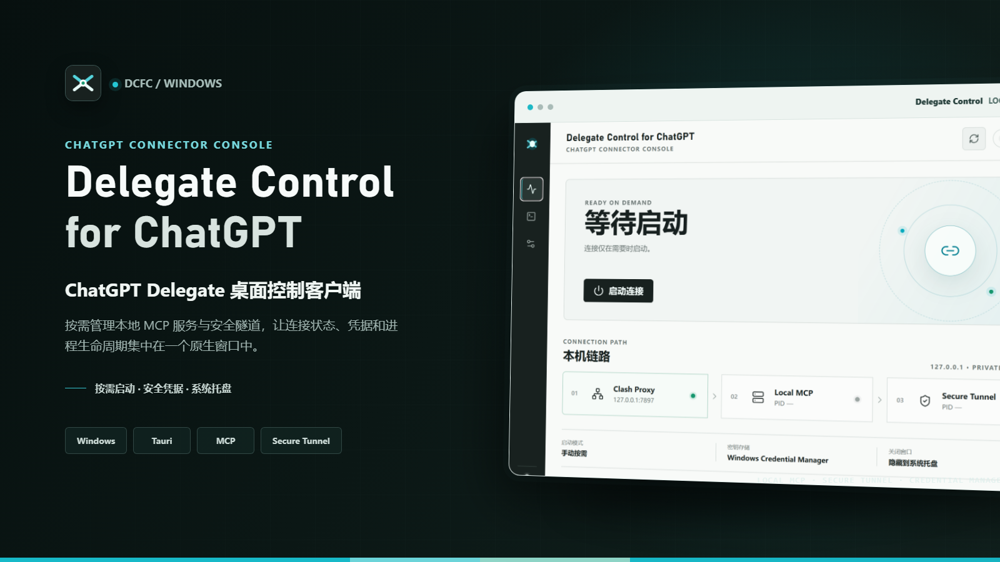

# Delegate Control for ChatGPT

Delegate Control for ChatGPT（DCFC）是一个 Windows 桌面控制客户端，用于管理本机的 ChatGPT Delegate MCP 服务和安全隧道。

> 本项目是第三方工具，并非 OpenAI 或 ChatGPT 官方产品。

## 多项目架构

DCFC 使用一条共享连接承载多个项目：

```text
ChatGPT Connector / Secure Tunnel
                |
        mcp-proxy（一个）
          /      |      \\
 chatgpt-delegate  ...  chatgpt-delegate
   项目 A MCP          项目 B MCP
      |                   |
   目录 A              目录 B
```

每个项目都是独立的 `chatgpt-delegate` 进程，并使用独立 MCP 端口和输出目录；项目之间不会混写。新增项目不需要新增 tunnel ID，也不需要为每个项目维护独立 Connector。对 ChatGPT 暴露的是固定 Router MCP 工具目录，项目通过可选 `project_id` 参数路由。

当只有一个启用项目时，项目工具可以省略 `project_id`。当两个或以上项目启用时，所有会创建或修改文件的操作必须显式提供 Project Key，例如 `project_id="screencast"`；Router 不会再把多项目写入静默回退到界面当前项目。读取和状态操作仍可在安全时使用当前项目便利回退。

### Project Name 与 Project Key

每个项目有两个不同身份：

- **项目名称**：面向用户显示，可随时修改，例如 `ScreenCast`。
- **Project Key / project_id**：ChatGPT 和 Router 使用的稳定路由标识，例如 `screencast`。

新建项目时，DCFC 会根据名称建议一个不冲突的 Project Key，首次保存前可以修改。项目保存后，普通名称修改不会改变 Project Key。

已有 Project Key 只能通过设置页中的显式迁移操作修改。迁移要求先停止全部连接，并会同步更新 DCFC 设置、活动项目引用和项目日志目录。ChatGPT 历史消息、旧提示和外部文档中的旧 `project_id` 无法自动更新，需要手工改用新 key。

## 使用方式

1. 打开 DCFC，在“设置 → 项目目录”中新增项目并选择文档输出目录。
2. 为需要同时在线的项目勾选“启用”，保存设置。
3. 点击“启动全部项目”。DCFC 会启动多个项目 MCP、一个 `mcp-proxy` 和一个 `tunnel-client`。
4. 日常在 ChatGPT 中用自然语言明确项目，例如“请在 ScreenCast（project_id: screencast）中保存会议纪要”。Router 始终使用固定裸工具名；多项目写入必须显式传入 `project_id`。项目不明确时，调用会在写入前被拒绝并返回可用项目名称与 key。
5. 修改项目目录、端口、名称或启用状态后，必须重启连接才会生效；界面会明确提示这一点。

### 编辑已有文本文件

编辑版 Connector 额外提供以下工具：

```text
read_text_file
append_text_file
replace_text_in_file
delete_text_from_file
```

这些工具只接受当前项目输出目录内的相对路径，并只处理 UTF-8 纯文本。替换和删除默认要求目标片段恰好出现一次；读取后可把返回的 `sha256` 作为 `expected_sha256` 传回，避免覆盖 Codex 或用户刚刚修改的文件。每次修改都会先在项目目录的 `.dcfc-backups` 中保留备份，再执行原子替换。

编辑工具和固定 Router 由 `chatgpt-delegate-edit.exe` 提供。升级 Connector 后必须停止并重新启动 DCFC 管理的项目 MCP、Router、Proxy 和 Tunnel；正式迁移完成后只需在 ChatGPT 中重新注册一次 Connector，后续项目增删不再改变工具清单。旧版 Connector 仍能使用原有 7 个报告/结果工具，但不会提供文本编辑工具。

当前选中的项目只是界面焦点，不会停止其他在线项目。也可以在总览或设置中单独启动/停止某个项目；停止一个项目不会停止其他项目，但共享 proxy/tunnel 会按当前项目列表重新加载。

## 功能

- 多个项目同时在线，共享一个 MCP Proxy 和一个 Tunnel
- 每个项目独立选择任意绝对文档输出目录
- 项目级 MCP 进程、端口、日志和状态
- 按需启动、停止、重新连接及单项目启停
- Runtime API Key 保存在 Windows Credential Manager，不写入配置或日志
- Windows Job Object 清理 MCP、Proxy、Tunnel 及其子进程
- 系统托盘、单实例运行和关闭窗口隐藏

## 外部依赖

- Windows 10/11 x64
- Node.js 与 npm
- Rust stable 工具链
- `chatgpt-delegate.exe`
- `mcp-proxy.exe`（外部依赖，DCFC 不打包、不提交二进制）
- `chatgpt-delegate-edit.exe`（编辑版 Connector，可由项目脚本构建）
- `tunnel-client.exe`
- 本地 Clash HTTP 代理，默认 `127.0.0.1:7897`

默认程序路径：

```text
%USERPROFILE%\.local\bin\chatgpt-delegate.exe
%USERPROFILE%\.local\bin\mcp-proxy.exe
D:\tunnel-client\install\tunnel-client.exe
```

如果 `mcp-proxy.exe` 不在默认路径，可在“设置 → 本机程序”中选择它。启动前 DCFC 会检查所有外部程序是否存在。

编辑版 Connector 构建后，可在“设置 → 本机程序 → MCP”中选择生成的 `chatgpt-delegate-edit.exe`。DCFC 会显示“文件编辑已支持”；如果继续使用旧 Connector，连接仍可启动，但界面会明确显示编辑工具不可用。

## 本地开发与构建

```powershell
npm install
npm run build
cargo test --manifest-path src-tauri/Cargo.toml
npm run tauri -- dev
npm run tauri -- build
```

安装包输出在：

```text
src-tauri/target/release/bundle/nsis/
src-tauri/target/release/bundle/msi/
```

## 配置与日志

非敏感设置保存在 `%APPDATA%\Delegate Control\settings.json`，自动生成的 proxy 配置保存在 `%APPDATA%\Delegate Control\mcp-proxy.toml`，日志保存在 `%APPDATA%\Delegate Control\logs\`。这些本机文件不应提交到 Git。

旧版本顶层 `output_directory` 会自动迁移为名为“默认项目”的项目配置。Runtime API Key 仍只通过 Windows Credential Manager 注入 Tunnel 子进程。

## 安全说明

- 不读取、输出、记录或提交 Runtime API Key。
- 不提交 `settings.json`、日志、测试 evidence、artifacts、`dist`、`target` 或本机密钥文件。
- 项目目录必须是绝对路径，并在 UI 中明确显示；目录不存在时，启动项目会创建它。
- 共享 proxy 只绑定 loopback 地址，不暴露到局域网。

## 回退基线

多项目改造前的保护标签为 `baseline-2026-09-22`。在确认当前改动已保存后，可基于该标签创建回退分支：

```powershell
git switch -c rollback-baseline-2026-09-22 baseline-2026-09-22
```

不要对含有用户改动的工作区执行破坏性 reset 或 checkout。
